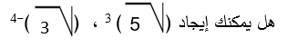
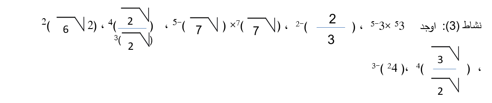
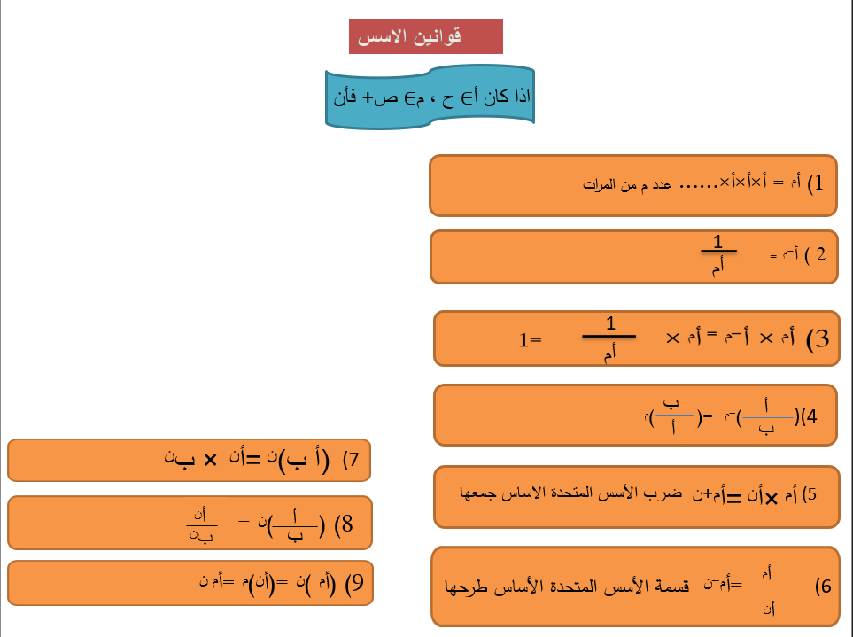
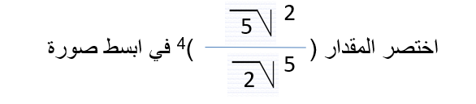
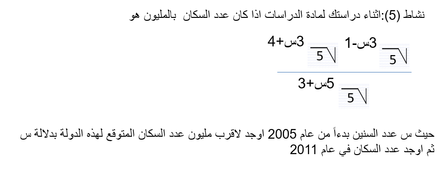

## القوى الصحيحة (غير السالبة والسالبة) في ح

### الأهداف

#### عزيزي التلميذ، بنهاية دراستك لهذا الدرس يُتوقع أن تكون قادراً على:

1. تتعرف قوانين الأسس غير السالبة في ح

2. تتعرف قوانين الأسس السالبة لعدد حقيقي لا يساوي صفر

3. تعمم قوانين الأسس غير السالبة على الأسس السالبة

### الأنشطة

#### ١.١ حوض سمك مستطيل الشكل مساحته ٦^٣ وطوله ٤^٣ أوجد عرضه

#### ١.٢ ماذا يقرأ العددين ٤^٣ ، ٣^٤- وما قيمتهما ؟

  <iframe style="position: absolute; top: 0; left: 0; width: 100%; height: 100%;" src="https://www.youtube.com/embed/SDg_VUAMZxw" frameborder="0" allow="accelerometer; autoplay; clipboard-write; encrypted-media; gyroscope; picture-in-picture" allowfullscreen></iframe>

  <iframe style="position: absolute; top: 0; left: 0; width: 100%; height: 100%;" src="https://www.youtube.com/embed/H5bc8xey2P0" frameborder="0" allow="accelerometer; autoplay; clipboard-write; encrypted-media; gyroscope; picture-in-picture" allowfullscreen></iframe>

#### ٢.١ 

  <iframe style="position: absolute; top: 0; left: 0; width: 100%; height: 100%;" src="https://www.youtube.com/embed/4xbjoY8XlRA" frameborder="0" allow="accelerometer; autoplay; clipboard-write; encrypted-media; gyroscope; picture-in-picture" allowfullscreen></iframe>

#### ٣.١ 

  <iframe style="position: absolute; top: 0; left: 0; width: 100%; height: 100%;" src="https://www.youtube.com/embed/kCMVfg4GM8Y" frameborder="0" allow="accelerometer; autoplay; clipboard-write; encrypted-media; gyroscope; picture-in-picture" allowfullscreen></iframe>

<a href="https://ar.symbolab.com/" target="_blank">استخدم سيمبولاب</a>
<a href="https://photomath.com/install/" target="_blank">استخدم فوتوماث</a>

#### ٤.١ 

#### ٥.١ 

### التقويم

#### ١.١ 