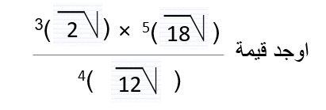

# القوى الصحيحة (غير السالبة والسالبة) في ح

## الاهداف

### عزيزي التلميذ بنهاية دراستك لهذا الدرس يتوقع ان تكون قادراً على:

#### 1. تتعرف قوانين الأسس غير السالبة في ح

#### 2. تتعرف قوانين الأسس السالبة لعدد حقيقي لايساوي صفر

#### 3. تعمم قوانين الأسس غير السالبة على الأسس السالبة

## الانشطه

### 1.1 حوض سمك مستطيل الشكل مساحته 6^3 وطوله 4^3 اوجد عرضه

### 1.2 ماذا يقرأ العددين 4^3 ، 3^4- وما قيمتهما ؟

  <iframe style="position: absolute; top: 0; left: 0; width: 100%; height: 100%;" src="https://www.youtube.com/embed/SDg_VUAMZxw" frameborder="0" allow="accelerometer; autoplay; clipboard-write; encrypted-media; gyroscope; picture-in-picture" allowfullscreen></iframe>

  <iframe style="position: absolute; top: 0; left: 0; width: 100%; height: 100%;" src="https://www.youtube.com/embed/H5bc8xey2P0" frameborder="0" allow="accelerometer; autoplay; clipboard-write; encrypted-media; gyroscope; picture-in-picture" allowfullscreen></iframe>

### 2.1 

  <iframe style="position: absolute; top: 0; left: 0; width: 100%; height: 100%;" src="https://www.youtube.com/embed/4xbjoY8XlRA" frameborder="0" allow="accelerometer; autoplay; clipboard-write; encrypted-media; gyroscope; picture-in-picture" allowfullscreen></iframe>

### 3.1 

  <iframe style="position: absolute; top: 0; left: 0; width: 100%; height: 100%;" src="https://www.youtube.com/embed/kCMVfg4GM8Y" frameborder="0" allow="accelerometer; autoplay; clipboard-write; encrypted-media; gyroscope; picture-in-picture" allowfullscreen></iframe>

<a href="https://ar.symbolab.com/" target="_blank">استخدم سيمبولاب</a>
<a href="https://photomath.com/install/" target="_blank">استخدم فوتوماث</a>

### 4.1 

### 5.1 

## التقويم

### 1.1 
