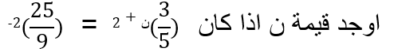

# حل المعادلات الأسية في ح

## الاهداف

### عزيزي التلميذ بنهاية دراستك لهذا الدرس يتوقع ان تكون قادراً على:

#### 1. تعرف المعادلة الاسية

#### 2. تحل المعادلات الأسية في ح اذا كان الأساس = الاساس

#### 3. تحل المعادلات الأسية في ح اذا كان الأس = الأس

## الانشطه

### 1.1 صندوق نباتات مستطيل مساحته 9^س وعرضه =3 اوجد طوله

### 2.1 هل يمكنك تعريف المعادلة الأسية

  <iframe style="position: absolute; top: 0; left: 0; width: 100%; height: 100%;" src="https://www.youtube.com/embed/LpyM2TSRekY" frameborder="0" allow="accelerometer; autoplay; clipboard-write; encrypted-media; gyroscope; picture-in-picture" allowfullscreen></iframe>

اي أن المعادلة الأسية هي : المعادله التي يكون الاس فيها مجهول مثل 3^س+5 =23

### 2.2 اوجد قيمة ن اذا كانت 3^ن = 3^5 ن^7 =2^7

  <iframe style="position: absolute; top: 0; left: 0; width: 100%; height: 100%;" src="https://www.youtube.com/embed/SwgUP7LHzLw" frameborder="0" allow="accelerometer; autoplay; clipboard-write; encrypted-media; gyroscope; picture-in-picture" allowfullscreen></iframe>

### 3.1 

<a href="https://ar.symbolab.com/" target="_blank">استخدم سيمبولاب</a>
<a href="https://photomath.com/install/" target="_blank">استخدم فوتوماث</a>

### 3.2 اذا كان 3^س2-2س=27 اوجد قيمة س

### 4.1 تسير سيارة بسرعة 3^ن-1 وتقطع مسافة مقدارها 81 متر في زمن قدره 9ث اوجد قيمة ن

### 4.2 اذا كان هناك ترابيزة كرة طاولة مستطيلة الشكل مساحتها 2س^2 ، عرضها 2×3^2 وطولها 1 متر اوجد قيمة س

## التقويم اوجد قيمة س اذا كان

### 1.1 3^س= 81

### 1.2 3^س-5 =7^س-5
