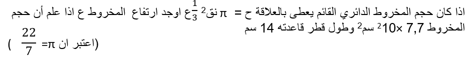
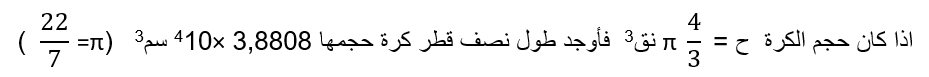

# العمليات الحسابية على القوى الصحيحة

## الأهداف

### عزيزي التلميذ بنهاية دراستك لهذا الدرس يتوقع أن تكون قادراً على:

#### ١. تجري العمليات الحسابية على القوى الصحيحة

#### ٢. تطبق قوانين الأسس لحل بعض المشكلات الحياتية

## الأنشطة

### ١.١ إذا كان هناك قالب شيكولاته على شكل مكعب =٢٤+٥÷٥×٣ سم٣ أوجد طول حرفه

  <iframe style="position: absolute; top: 0; left: 0; width: 100%; height: 100%;" src="https://www.youtube.com/embed/L_N8IWCYMiY" frameborder="0" allow="accelerometer; autoplay; clipboard-write; encrypted-media; gyroscope; picture-in-picture" allowfullscreen></iframe>

### ٢.١ هل يمكنك إيجاد ٢٠÷(١٢-٢)×٣^٢-٢

  <iframe style="position: absolute; top: 0; left: 0; width: 100%; height: 100%;" src="https://www.youtube.com/embed/Bo5TGekKcyQ" frameborder="0" allow="accelerometer; autoplay; clipboard-write; encrypted-media; gyroscope; picture-in-picture" allowfullscreen></iframe>

## طريقة إجراء العمليات الحسابية

### ١. فك الأقواس الداخلية ثم الخارجية

### ٢. حساب قوى العدد (الأسس)

### ٣. إجراء عمليتي الضرب والقسمة بالترتيب من اليمين لليسار

### ٤. إجراء عمليتي الجمع والطرح بالترتيب من اليمين لليسار

### ٣.١ 

<a href="https://ar.symbolab.com/" target="_blank">استخدم سيمبولاب</a>
<a href="https://photomath.com/install/" target="_blank">استخدم فوتوماث</a>

### ٤.١ إذا كان عدد السكان (ص) بالمليون في إحدى الدول يتحدد من العلاقة ص= ١١,٧(١,٠٢)س حيث س عدد السنين بدءاً من عام ٢٠٠٥ فأوجد لأقرب مليون عدد السكان المتوقع لهذه الدول في عام

#### ١. ٢٠١١

#### ٢. ٢٠٠٠

### ٤.٢ نفترض أن لدينا نصاً يحتوي على مجموعة من الكلمات يرغب التلميذ في معرفة العدد النهائي للكلمات في النص بعد إجراء التعديلات عليه ، إذا كان النص يحتوي في الأصل على ١٥٠ كلمة ، قرر الطالب إضافة ٢٠ جملة جديدة حيث تحتوي كل جملة على ٥ كلمات ،كما قام بحذف ١٥ كلمة من النص الأصلي

### ٥.١ 

  <iframe style="position: absolute; top: 0; left: 0; width: 100%; height: 100%;" src="https://www.youtube.com/embed/0Af7sMxdbCw" frameborder="0" allow="accelerometer; autoplay; clipboard-write; encrypted-media; gyroscope; picture-in-picture" allowfullscreen></iframe>

  <iframe style="position: absolute; top: 0; left: 0; width: 100%; height: 100%;" src="https://www.youtube.com/embed/fu29vN9Rv7o" frameborder="0" allow="accelerometer; autoplay; clipboard-write; encrypted-media; gyroscope; picture-in-picture" allowfullscreen></iframe>

## التقويم

### ١.١ 

  <iframe style="position: absolute; top: 0; left: 0; width: 100%; height: 100%;" src="https://www.youtube.com/embed/oAah2H9unMY" frameborder="0" allow="accelerometer; autoplay; clipboard-write; encrypted-media; gyroscope; picture-in-picture" allowfullscreen></iframe>

