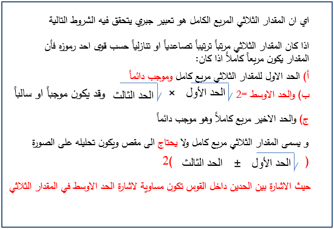
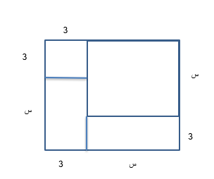

## تحليل المقدار الثلاثي المربع الكامل

### الأهداف

#### عزيزي التلميذ، بنهاية دراستك لهذا الدرس يُتوقع أن تكون قادراً على:

1. تعرف المقدار الثلاثي المربع الكامل
2. تحلل المقدار الثلاثي المربع الكامل تحليلاً كاملاً

### الأنشطة

#### ١.١ خزان مياه مساحته ٤ س² + ١٢ س + ٩، طول أحد ضلعيه ٢ س + ٣. أوجد طول الضلع الآخر، وهل الخزان مربع الشكل أم مستطيل الشكل؟

  <iframe style="position: absolute; top: 0; left: 0; width: 100%; height: 100%;" src="https://www.youtube.com/embed/SPvgJJT5lIA" frameborder="0" allow="accelerometer; autoplay; clipboard-write; encrypted-media; gyroscope; picture-in-picture" allowfullscreen></iframe>

  <iframe style="position: absolute; top: 0; left: 0; width: 100%; height: 100%;" src="https://www.youtube.com/embed/cP1sPvGtsY0" frameborder="0" allow="accelerometer; autoplay; clipboard-write; encrypted-media; gyroscope; picture-in-picture" allowfullscreen></iframe>

#### ٢.١ هل يمكنك تعريف المقدار الثلاثي المربع الكامل؟

  <iframe style="position: absolute; top: 0; left: 0; width: 100%; height: 100%;" src="https://www.youtube.com/embed/1rZbq4JpWAs" frameborder="0" allow="accelerometer; autoplay; clipboard-write; encrypted-media; gyroscope; picture-in-picture" allowfullscreen></iframe>

#### ٢.٢ حلل المقدار ٢٥ س² - ١٠ س + ١

#### ٣.١ حلل المقدار ٤ س² + ٤٤ س ص + ١٢١ ص²

<a href="https://ar.symbolab.com/" target="_blank">استخدم سيمبولاب</a>
<a href="https://photomath.com/install/" target="_blank">استخدم فوتوماث</a>

#### ٣.٢ في الشكل المقابل مربع مقسم إلى مربع كبير طول ضلعه س ومربع صغير طول ضلعه ٣ ومستطيلان بعديهما س و ٣. أوجد مجموع مساحتهم، ثم قم بتحليل المقدار الناتج.

#### ٤.١ إذا كان عدد السكان بالمليون يعطى بالعلاقة ك أ² ب² + ١٢ أ ب + ٩، أوجد قيمة ك التي تجعل المقدار الثلاثي مربع كامل، ثم أوجد عدد السكان عند أ = ٥، ب = ١٠.

#### ٥.١ مسجد مربع الشكل مساحته (٩ س² + ٣٠ س + م) م²، طول ضلعه عدد نسبي. أوجد قيمة م، ثم أوجد محيط المربع عند س = ٢.

  <iframe style="position: absolute; top: 0; left: 0; width: 100%; height: 100%;" src="https://www.youtube.com/embed/Sc9Tir7gfxA" frameborder="0" allow="accelerometer; autoplay; clipboard-write; encrypted-media; gyroscope; picture-in-picture" allowfullscreen></iframe>

### التقويم

#### ١.١ مربع طول قطره (أ + ٣) ومساحته (أ² + ٦ أ + ج). أوجد قيمة ج.

  <iframe style="position: absolute; top: 0; left: 0; width: 100%; height: 100%;" src="https://www.youtube.com/embed/or_0AjT6WpA" frameborder="0" allow="accelerometer; autoplay; clipboard-write; encrypted-media; gyroscope; picture-in-picture" allowfullscreen></iframe>

