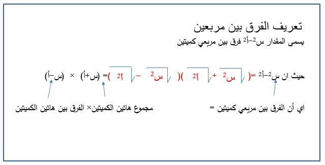
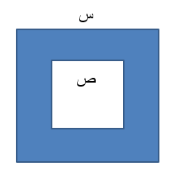

## تحليل الفرق بين المربعين

### الأهداف

#### عزيزي التلميذ، بنهاية دراستك لهذا الدرس يُتوقع أن تكون قادراً على:

1. تعريف الفرق بين المربعين.

2. حل مسائل متنوعة على الفرق بين المربعين.

### الأنشطة

#### ١.١ قطعة أرض مستطيلة طول أحد ضلعيها س + ٣ وطول الضلع الآخر س - ٣. أوجد مساحتها.

  <iframe style="position: absolute; top: 0; left: 0; width: 100%; height: 100%;" src="https://www.youtube.com/embed/11HLBZnzfmc" frameborder="0" allow="accelerometer; autoplay; clipboard-write; encrypted-media; gyroscope; picture-in-picture" allowfullscreen></iframe>

#### ٢.١ عرف الفرق بين مربعين؟

  <iframe style="position: absolute; top: 0; left: 0; width: 100%; height: 100%;" src="https://www.youtube.com/embed/AyhhHpHVlnI" frameborder="0" allow="accelerometer; autoplay; clipboard-write; encrypted-media; gyroscope; picture-in-picture" allowfullscreen></iframe>

#### ٢.٢ حلل المقدار س² - ٢٥.

#### ٣.١ حلل ١/٩ س² - ١/٤.

<a href="https://ar.symbolab.com/" target="_blank">استخدم سيمبولاب</a>
<a href="https://photomath.com/install/" target="_blank">استخدم فوتوماث</a>

#### ٤.١ في تجربة عملية، قام الباحثون بقياس طول جناحي نوعين مختلفين من الطيور. طول جناح الطائر الأول يُمثل بالمتغير س، وطول جناح الطائر الثاني يُمثل بالمتغير ص. الفرق بين مربعي طول جناحي الطائرين هو ١٤٤ سم². إذا كان طول جناح الطائر الأول أكبر بمقدار ٦ سم من طول جناح الطائر الثاني، أوجد س + ص.

#### ٥.١ في الشكل الذي أمامك، حديقة مربعة الشكل س - ص = ٣ م، س + ص = ٩ م. أوجد مساحة الجزء المظلل.

### التقويم

#### ١.١ حلل (أ² - ٢ أ ب + ب²) - ج².

#### ١.٢ إذا كان س > ص، س² - ٢ س ص + ص² = ١٦، س + ص = ٩. أوجد قيمة س² - ص².

### الواجب المنزلي 

#### مثلث قائم الزاوية طول وتره 41 سم وطول احد ضلعي القائمة 40 سم استخدم التحليل لحساب طول ضلع القائمة الاخر 

  <iframe style="position: absolute; top: 0; left: 0; width: 100%; height: 100%;" src="https://www.youtube.com/embed/_ZVLzutyTsI" frameborder="0" allow="accelerometer; autoplay; clipboard-write; encrypted-media; gyroscope; picture-in-picture" allowfullscreen></iframe>

