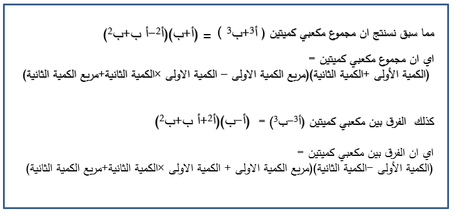

## تحليل مجموع المكعبين والفرق بينهما

### الأهداف

#### عزيزي التلميذ، بنهاية دراستك لهذا الدرس يُتوقع أن تكون قادراً على:

1. تعريف مجموع مكعبي كميتين.

2. تعريف الفرق بين مكعبي كميتين.

3. حل مسائل متنوعة على مجموع مكعبي كميتين.

4. حل مسائل متنوعة على الفرق بين مكعبين كميتين.

### الأنشطة

#### ١.١ برميل زيت على شكل أسطوانة دائرية قائمة، ارتفاعه س + ٢، ومساحة قاعدته س² - ٢ س + ٤. أوجد حجمه.

  <iframe style="position: absolute; top: 0; left: 0; width: 100%; height: 100%;" src="https://www.youtube.com/embed/DeRI31oKU_I" frameborder="0" allow="accelerometer; autoplay; clipboard-write; encrypted-media; gyroscope; picture-in-picture" allowfullscreen></iframe>

#### ٢.١ هل يمكنك تعريف مجموع المكعبين والفرق بينهما؟

  <iframe style="position: absolute; top: 0; left: 0; width: 100%; height: 100%;" src="https://www.youtube.com/embed/jLMAhLK-nWc" frameborder="0" allow="accelerometer; autoplay; clipboard-write; encrypted-media; gyroscope; picture-in-picture" allowfullscreen></iframe>

#### ٣.١ حلل ٨س³ + ١/٨.

<a href="https://ar.symbolab.com/" target="_blank">استخدم سيمبولاب</a>
<a href="https://photomath.com/install/" target="_blank">استخدم فوتوماث</a>

#### ٣.٢ حلل المقدار س³ + ١٠ على صورة مجموع مكعبين.

#### ٤.١ في دراسة اقتصادية، تم تحليل إيرادات شركتين تعملان في نفس القطاع. الإيرادات الشهرية للشركة الأولى يُعبر عنها بالمتغير س، والإيرادات الشهرية للشركة الثانية يُعبر عنها بالمتغير ص. الفرق بين مكعبي إيرادات الشركتين هو ١٠٠٠ مليون دولار. حلل المقدار الناتج، إذا كانت إيرادات الشركة الأولى أكبر بمقدار ٢ مليون دولار من إيرادات الشركة الثانية. أوجد قيمة المقدار س² + س ص + ص².

  <iframe style="position: absolute; top: 0; left: 0; width: 100%; height: 100%;" src="https://www.youtube.com/embed/dNH9vVMSaQY" frameborder="0" allow="accelerometer; autoplay; clipboard-write; encrypted-media; gyroscope; picture-in-picture" allowfullscreen></iframe>

#### ٥.١ إذا كان خزانا مياه على شكل مكعبين طول حافتيهما س، ص. أوجد الفرق بين حجميهما إذا كان س² - ص² = ٣٦، س + ص = ٦، س² + س ص + ص² = ٨.

  <iframe style="position: absolute; top: 0; left: 0; width: 100%; height: 100%;" src="https://www.youtube.com/embed/UWa1fAsYmKQ" frameborder="0" allow="accelerometer; autoplay; clipboard-write; encrypted-media; gyroscope; picture-in-picture" allowfullscreen></iframe>

### التقويم

#### ١.١ حلل س⁶ - ٦٤ ص⁶.

#### ١.٢ حلل ٢٧ - س³.
