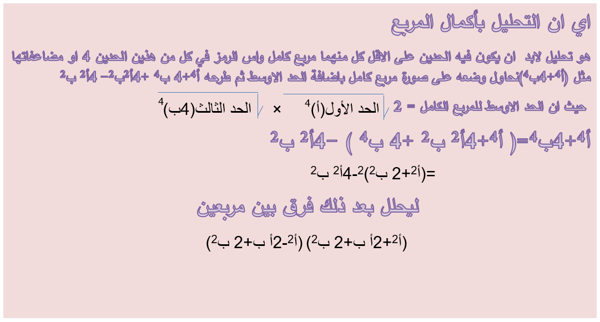

# التحليل باكمال المربع

## الاهداف

### عزيزي التلميذ بنهاية دراستك لهذا الدرس يتوقع ان تكون قادراً على:

#### 1. تعرف التحليل باكمال المربع

#### 2. تحل مسائل متنوعة على التحليل باكمال المربع

## الانشطه

### 1.1 اشترى ناصر قطعة قماش مستطيلة الشكل احد بعديها س4+4 م ، البعد الاخر 1 م اوجد المساحة وحلل الناتج ثم اوجد مساحته اذا كان س2+2س+2=2 ، س2-2س+2 =3

### 2.1 هل يمكنك تعريف اكمال المربع

  <iframe style="position: absolute; top: 0; left: 0; width: 100%; height: 100%;" src="https://www.youtube.com/embed/mrF75y1ubII" frameborder="0" allow="accelerometer; autoplay; clipboard-write; encrypted-media; gyroscope; picture-in-picture" allowfullscreen></iframe>

### 2.2 4س4+ص4

<a href="https://ar.symbolab.com/" target="_blank">استخدم سيمبولاب</a>
<a href="https://photomath.com/install/" target="_blank">استخدم فوتوماث</a>

### 3.1 حلل س4+س2 ص2+ص4

  <iframe style="position: absolute; top: 0; left: 0; width: 100%; height: 100%;" src="https://www.youtube.com/embed/-6tH5QI5HyA" frameborder="0" allow="accelerometer; autoplay; clipboard-write; encrypted-media; gyroscope; picture-in-picture" allowfullscreen></iframe>

### 4.1 جسيم يتحرك تحت تأثير قوة معينة مقدارها 9س4+2س2+1 نيوتن قم بتحليل المقدار ، ثم اوجد قيمة القوة عند س =5

### 5.1 مخزن العاب مستطيل الشكل مساحته س8 -16 ص8 وأحد بعديه (س2+2ص2+2س ص) × (س2+2ص2 )اوجد البعد الاخر عند س= 2 ، ص=1

## التقويم

### 1.1 حلل س8-21س2-100
