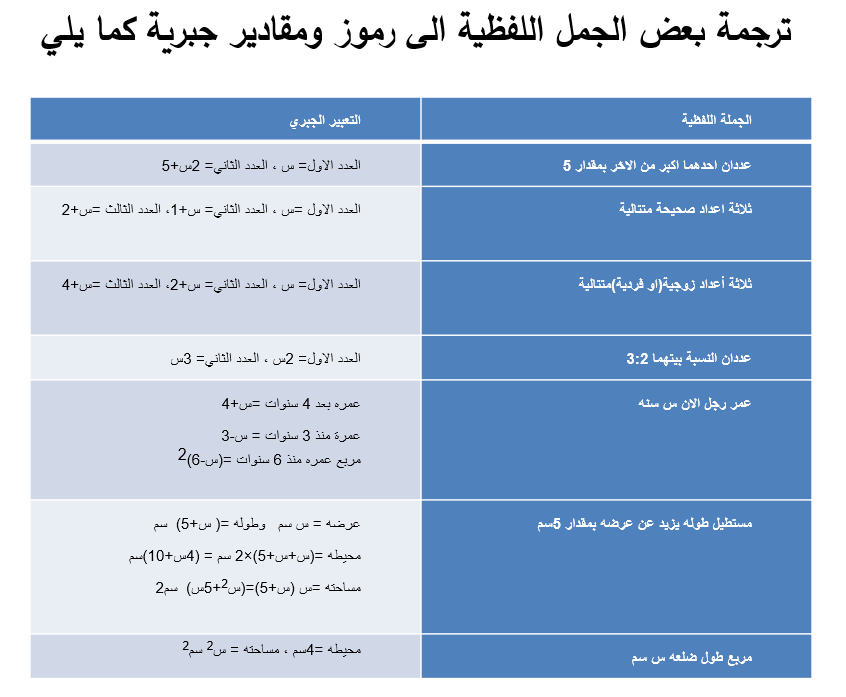
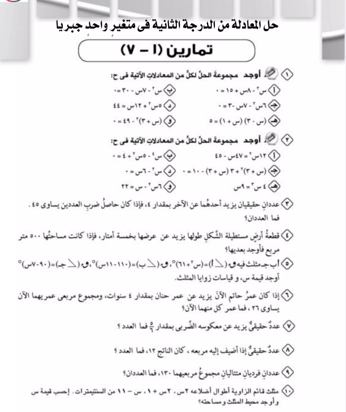

# تطبيقات على حل معادلة من الدرجة الثانية في متغير واحد جبرياً

## الاهداف

### عزيزي التلميذ بنهاية دراستك لهذا الدرس يتوقع ان تكون قادراً على:

#### 1. تحل مسائل لفظية من الدرجة الثانية في متغير واحد جبرياً

#### 2. تستخدم الجبر لحل مسائل حياتية

## الانشطه

### 1.1 يزيد عمر باسم عن عمر حنان بمقدار سنتين فأذا كان مجموع عمريهما 26 سنه ففوجد عمر باسم

### 2.1 اذا كان ثلاثة امثال مربع العدد س يساوي 12 اوجد قيمة س

### 3.1 عدد صحيح موجب اذا اضيف ضعف مربعه الى معكوسه الجمعي كان الناتج 91 فما هو العدد

### 4.1 ملعب كرة قدم مساحته 7000 متر مربع ، طوله يزيد عن عرضه بمقدار 30 متراً ، ما المسافة التي يقطعها عداء اذا قام بالجري حول الملعب دورتين كاملتين

  <iframe style="position: absolute; top: 0; left: 0; width: 100%; height: 100%;" src="https://www.youtube.com/embed/6xsMMy_arZ0" frameborder="0" allow="accelerometer; autoplay; clipboard-write; encrypted-media; gyroscope; picture-in-picture" allowfullscreen></iframe>

### 4.2 ذهب احمد الى المكتبة وقرأ عدد س كتباً فإذا كان مربع الكتب التي قرأها هي يساوي 6 مضروباً في العدد الذي قرأه مطروحاً منه 9، ما عدد الكتب التي قرأها أحمد؟

### 5.1 اذا كان عمر كمال الان يزيد عن عمر اخيه انيس بمقدار 3 سنوات ومنذ اربع سنوات كان حاصل ضرب عمريهما حينئذ 18 فما عمر كل منهما الان؟

## التقويم

### 1.1 حجرة عرضها 9 م ، طولها 12م يخطط مهندس ديكور لشراء سجادة بحيث يترك حول السجادة شريط متساوي العرض غير مغطي ، كم يكون عرض الشريط اذا كانت السجادة تغطي نصف مساحة الحجرة ؟

## الواجب المنزلي

### 1.1 احسب محيط مثلث قائم الزاوية طولا ضلعي القائمة (5س+3)، (س+5) من السنتيمترات ومساحته 24 سم2

  <iframe style="position: absolute; top: 0; left: 0; width: 100%; height: 100%;" src="https://www.youtube.com/embed/NTiNQR33pWM" frameborder="0" allow="accelerometer; autoplay; clipboard-write; encrypted-media; gyroscope; picture-in-picture" allowfullscreen></iframe>

  <iframe style="position: absolute; top: 0; left: 0; width: 100%; height: 100%;" src="https://www.youtube.com/embed/p_wCrB5VfE0" frameborder="0" allow="accelerometer; autoplay; clipboard-write; encrypted-media; gyroscope; picture-in-picture" allowfullscreen></iframe>

